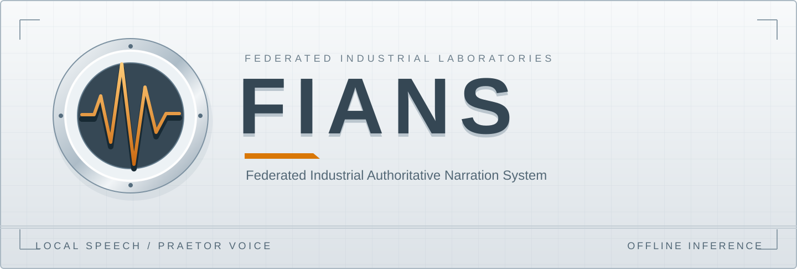

<p align="center">
  
</p>

<p align="center">Local English narration with Praetor, a measured synthetic voice with a spacious sound.</p>

<p align="center">
  
</p>

<p align="center">
  <a href="docs/install.md">Install</a> |
  <a href="docs/operations.md">Operate</a> |
  <a href="docs/voices.md">Praetor</a> |
  <a href="docs/integration.md">Integrate</a> |
  <a href="docs/README.md">Documentation</a>
</p>

<p align="center"></p>

FIANS turns text into local speech for tools, applications and system narration.
Chatterbox Nano generates the underlying voice from a short reference. A separate
effects stage adds the Praetor sound: restrained pitch doubling, gentle chorus
and diffuse reverb, with the main voice kept clear.

The command writes a WAV or plays it through the desktop audio system. A private
worker retains the CPU model between requests and exits after five idle minutes.
Speech generation uses local files and needs no account, API key or network service.

Praetor is a voice profile, not a separately trained model. Its reference and
effects occupy about 0.49 MB. The unchanged base weights occupy about 1.94 GB and
are installed separately from a pinned upstream Hugging Face revision.

## Overview

| Surface | Function |
| --- | --- |
| Render | Create mono 24 kHz PCM16 WAV from a text argument or standard input. |
| Speak | Generate and play speech with an explicit volume control. |
| Worker | Reuse the resident CPU model; inspect status and stop it when finished. |
| Praetor | A packaged synthetic reference and reproducible sound treatment. |
| Model storage | Explicit installation, exact revision and SHA256 verification. |
| Integration | A small command interface for scripts and applications. |

This version targets English on Linux x86-64 with Python 3.12. It uses four CPU
threads. GPU execution, streaming audio and a network API are outside the current
interface. See [requirements and support](docs/install.md#requirements).

<p align="center"></p>

## Install

From a source checkout with the [system prerequisites](docs/install.md#requirements)
installed:

```sh
./install.sh
~/.local/bin/fians models install
~/.local/bin/fians render --text 'The system is ready.' --output voice.wav
```

The installer creates a private Python runtime and a command launcher without
sudo. The separate `models install` command downloads and verifies the selected
weights. Later speech requests use those local files and do not download models.

For an existing verified model directory, use `./install.sh --model-from /path/to/model`
to register it without making another copy. See [installation](docs/install.md)
for updates, alternate locations and removal.

## Use Praetor

When `~/.local/bin` is on PATH:

```sh
fians speak --text 'The next report is ready.' --volume 0.3
printf '%s' 'All systems are available.' | fians render --output report.wav
fians status
fians stop
```

`render` preserves an existing output unless `--force` is supplied. Requests accept
up to 2,000 characters and split long text at sentence or word boundaries.
The first request loads the model; subsequent requests share the same worker.
See [operation](docs/operations.md) for queue, timeout and shutdown behavior.

<p align="center"></p>

## Documentation

The [manual index](docs/README.md) gives the reading order and common terms.

| Task | Guide |
| --- | --- |
| Install, update or remove FIANS | [Installation](docs/install.md) |
| Generate speech and manage the worker | [Operation](docs/operations.md) |
| Understand the voice and its treatment | [Praetor voice](docs/voices.md) |
| Install, verify or reuse the base weights | [Model storage](docs/models.md) |
| Add narration to another application | [Integration](docs/integration.md) |
| Understand processing and local state | [Architecture](docs/architecture.md) |
| Diagnose startup, playback or quality issues | [Troubleshooting](docs/troubleshooting.md) |
| Build source and distribution packages | [Packaging and releases](docs/releases.md) |
| Check a change and its runtime behavior | [Testing](docs/testing.md) |

## Development

The application contracts run with the Python standard library and do not load
the model. Actual speech and installer checks require the full runtime; passing
source checks alone does not establish voice quality or installation support.
See [testing](docs/testing.md) and [contributing](CONTRIBUTING.md).

<details>
<summary>Source layout</summary>

```text
src/fians/       command, worker, model storage and sound treatment
voices/praetor/  reference audio, effect preset and voice metadata
models/         pinned base-model manifest
packaging/      runtime dependencies and distribution builder
tests/          command, storage and lifecycle contracts
docs/           operator manuals and technical reference
notices/        upstream component notices
```

</details>

FIANS application code and its authored effect preset use Apache-2.0.
The upstream engines and model retain their own notices. The supplied synthetic
reference is identified separately in the voice metadata.
See [LICENSE](LICENSE), [NOTICE](NOTICE) and [dependencies](docs/dependencies.md).
