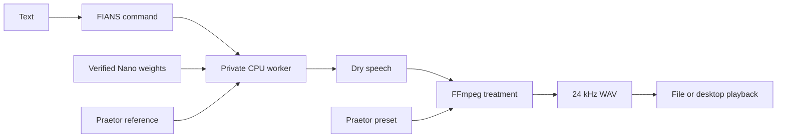

# Architecture

[Documentation](README.md) | [Security](../SECURITY.md) | [Dependencies](dependencies.md)

## Contents

- [Speech pipeline](#speech-pipeline)
- [Worker and state](#worker-and-state)
- [Model installation](#model-installation)
- [Scope](#scope)

## Speech pipeline

The command validates input and connects to a local worker. Long text is divided
into short segments. Nano generates each segment from the loaded reference;
the worker joins them and applies the preset through FFmpeg.

The effects stage owns pitch doubling, equalization, chorus, light distortion,
reverb and loudness adjustment. It keeps the model's speaker conditioning separate
from the character's final sound. The upstream audio watermark remains enabled.

## Worker and state

Each configured application home uses a private local worker. A Unix socket carries
requests and responses. Process locks coordinate startup and shutdown. The worker
serializes speech generation and retains model state between requests.

| State | Location or lifetime |
| --- | --- |
| Application configuration and managed models | `FIANS_HOME`, defaulting to the XDG user data directory under `fians`. |
| Python runtime | The installer prefix; separate from model configuration. |
| Reference, preset and model manifest | Checkout assets or installed package data. |
| Worker socket, locks and diagnostic log | A private runtime directory for the current user. |
| Intermediate speech files | Temporary files during rendering. |
| Requested output | The caller's selected WAV path. |

The worker runs CPU inference with four threads and exits after 300 idle seconds.
There is no TCP port, boot service or GPU allocation. A client disconnect does not
necessarily cancel the active synthesis. `stop` confirms worker exit before success.

The voice fingerprint binds the loaded reference and preset. A detected asset
change requires restarting the worker. The base-model manifest separately binds
all required weight files to an exact upstream revision.

## Model installation

`models install` is the network-capable model setup operation. It obtains selected
files from a fixed revision and verifies their hashes. `--from-dir` verifies and
registers existing files without copying them. Speech requests use the configured
local directory and offline loading.

Hash verification establishes agreement with the distributed manifest; it does
not independently establish the trustworthiness of that manifest or its source.
Install FIANS and runtime dependencies from trusted distributions.

## Scope

FIANS packages one English voice profile and one pinned CPU model backend. It does
not train or fine-tune weights, route requests to hosted synthesis, manage multiple
speakers or expose arbitrary reference cloning through the CLI. Applications use
the command interface and own their message policy and output retention.

[Previous: Integration](integration.md) | [Next: Troubleshooting](troubleshooting.md)
